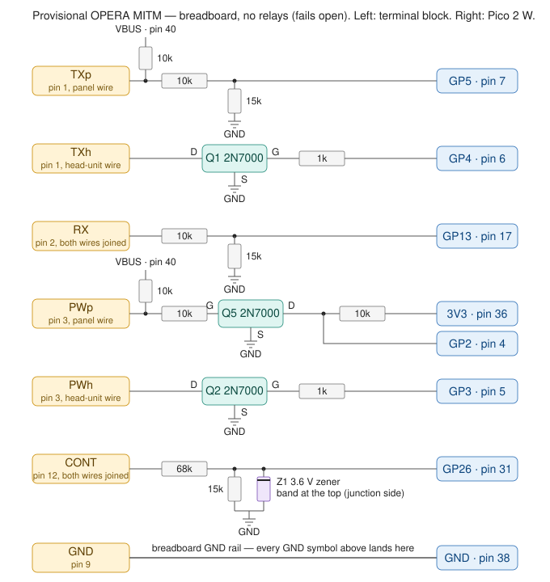
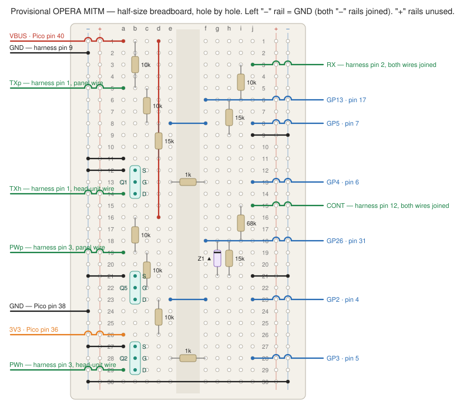

# OPERA interceptor board — perfboard layout (phase 1 + phase 2, built once)

The listen-only tap from BUILD_NOTES §30.2 plus the phase-2 interceptor (bypass relays, output
drivers, CM4 reset), on the **7 × 9 cm** pad-per-hole board. Every hole is an isolated plated
pad: every connection below is a component lead, a **solder bridge** between two neighbouring
pads, or a piece of **insulated wire** (either side of the board). Two **bare** bus wires run on
the solder side.

Design notes (why it looks like this):
- **Bypass.** With the Pico unpowered both relays are released and the panel's TX and PWR SW
  wires pass straight through to the head unit (relay NC contacts). The Pico energises them
  only once it is running and in control.
- **Two poles per relay.** Pole A switches the head-unit wire between the panel (NC) and the
  Pico's driver (NO). Pole B connects a 10k pull-up **to VBUS (5 V)** onto the panel wire only
  when energised, so the panel side looks exactly like stock (5 V, ~10k) and the phase-1
  input stages work unchanged; in bypass nothing loads the car's lines.
- **Inputs are unchanged from phase 1**: 10k/15k dividers on TX and RX, a 2N7000 gate buffer
  on PWR SW (the head unit senses load on that line — a divider reads as "pressed"), 68k/15k
  + zener on CONT.
- **Outputs are open-drain**: a 2N7000 pulls the head-unit wire low; the head unit's own
  pull-up does the rest. Same for the CM4's RUN_PG pin (TOFU J1, §30.6).
- **Pico pins chosen for hardware UARTs**: TX_in = GP5 (UART1 RX), TX_out = GP4 (UART1 TX —
  the driver inverts, use the GPIO output-invert), RX_in = GP13 (UART0 RX).

## Pico pin map (11-pin header, row 34)

| Header hole | Pico | Direction | Signal |
|---|---|---|---|
| A34 | GP2 | in | PW_in — buffer output, **inverted** (low idle, high pressed) |
| B34 | GP5 | in | TX_in — panel's OPERA TX (UART1 RX) |
| C34 | GP4 | out | TX_out — drives Q1 (high = line pulled low) |
| D34 | GP13 | in | RX_in — head unit's OPERA RX (UART0 RX) |
| E34 | GP26 | in | CONT (ADC0) |
| F34 | 3V3 | — | buffer pull-up |
| G34 | GP3 | out | PW_out — drives Q2 (fake power press) |
| H34 | VBUS | — | 5 V: relay coils, panel pull-ups |
| I34 | GND | — | |
| J34 | GP6 | out | RLY — drives Q3, energises both relays |
| K34 | GP7 | out | RST — drives Q4, pulls CM4 RUN_PG low |

## Parts

| Ref | Part | Ref | Part |
|---|---|---|---|
| R1, R3, R5, R6, R9, R10 | 10k | Q1–Q4 | 2N7000 drivers (TX, PWR, relays, reset) |
| R2, R4, R8 | 15k | Q5 | 2N7000 PWR SW input buffer |
| R7 | 68k | K1, K2 | Omron G5V-2-H1 DC5 |
| R14 | 68k (reset gate pull-down) | D1 | 1N4007 relay flyback |
| R15–R18 | 1k gate resistors | Z1 | 1N5227B 3.6 V zener |
| terminals | 7 + 2 positions, 5.08 mm | header | 11 × 2.54 mm |

## Coordinates

Long side vertical. **Columns A–Z left → right, rows 1–34 top → bottom.** Row 1 is the top
edge. Count holes on your board; if it's 25 or 27 wide, only columns A–V are used.

```
      A B C D E F G H I J K L M N O P Q R S T U V
  2   ·[T][T][T][T][T][T][T]· · · ·[T][T]·           terminals: B TXp D TXh F RX H PWp J PWh L CONT N GND · S RUN U GNDpi
  3   · R1  · · R3  · R5  · · · R7 ·
  :     |       |     |         |
  7   · R1  · · R3  · |   · · · R7 ·
  8   · R2=o· · R4=o  R5  · · · R8=Z=o                = bridge, o = output pad
  9   · |   · · |   S G D=o · · |  |                  Q5 buffer: G9 S, H9 G, I9 D
 10   · |   · · |     · R6  · · |  |
 12   · R2  · · R4    · |   · · R8=Z
 14   ·       ·       · R6
 16   ·[K1 1]=·  [4] [6] [8]     [K2 1]=· [4] [6] [8]      relay pins: coil B/N, COM E/Q, NC G/S, NO I/U
 19   ·[K1 16]=· [13][11][9]=·   [K2 16]=·[13][11][9]=·
 20   ·                   R9 · D1                 R10
 24   ·                   R9 · D1                 R10
 25   ═══════════════════ VBUS bus (bare, solder side) ═══════════════════
 28   · S G D · S G D · S G D                     Q1 B-C-D · Q2 F-G-H · Q3 I-J-K
 29   ·   R15 ·   R16 ·   R17 · · · R14→R14
 30   ·                       · S G D             Q4: M30 S, N30 G, O30 D
 31   ·                         · R18
 32   ═══════════════════ GND bus (bare, solder side) ════════════════════
 33   ·   R15     R16     R17     R18
 34   [GP2 GP5 GP4 GP13 GP26 3V3 GP3 VBUS GND GP6 GP7]   header A34–K34
```

## Placement

| Ref | From | To | Notes |
|---|---|---|---|
| terminals | B2 TXp · D2 TXh · F2 RX · H2 PWp · J2 PWh · L2 CONT · N2 GND | | one 7-position run |
| terminals | S2 RUN · U2 GNDpi | | to TOFU J1 pins 3 and 2 |
| R1 10k | B3 | B7 | TX top |
| R2 15k | B8 | B12 | TX bottom |
| R3 10k | F3 | F7 | RX top |
| R4 15k | F8 | F12 | RX bottom |
| R5 10k | H3 | H8 | buffer gate |
| Q5 2N7000 | G9 = S, H9 = G, I9 = D | | flat face towards you, legs down |
| R6 10k | I10 | I14 | buffer pull-up to 3V3 |
| R7 68k | L3 | L7 | CONT top |
| R8 15k | L8 | L12 | CONT bottom |
| Z1 1N5227B | **M8 = band** | M12 = plain | |
| K1 G5V-2 | pins 1/16 at B16/B19 · 4/13 at E16/E19 · 6/11 at G16/G19 · 8/9 at I16/I19 | | coil end at column B |
| K2 G5V-2 | pins 1/16 at N16/N19 · 4/13 at Q16/Q19 · 6/11 at S16/S19 · 8/9 at U16/U19 | | coil end at column N |
| R9 10k | J20 | J24 | TX panel pull-up |
| R10 10k | V20 | V24 | PWR panel pull-up |
| D1 1N4007 | L20 = plain (anode) | **L24 = band (cathode)** | flyback |
| Q1 2N7000 | B28 = S, C28 = G, D28 = D | | TX driver |
| Q2 2N7000 | F28 = S, G28 = G, H28 = D | | PWR driver |
| Q3 2N7000 | I28 = S, J28 = G, K28 = D | | relay driver |
| Q4 2N7000 | M30 = S, N30 = G, O30 = D | | reset driver |
| R15 1k | C29 | C33 | Q1 gate ← GP4 |
| R16 1k | G29 | G33 | Q2 gate ← GP3 |
| R17 1k | J29 | J33 | Q3 gate ← GP6 |
| R18 1k | N31 | N33 | Q4 gate ← GP7 |
| R14 68k | N29 | R29 | Q4 gate pull-down (horizontal) |
| header | A34 … K34 | | order as in the pin map |

Relay orientation: the two coil pins are the pair at the end with the orientation mark on the
case. Which of the two rows is "pole A" doesn't matter — both poles are wired identically
(COM at column E/Q, NC at G/S, NO at I/U) except for what hangs off them, and the two poles are
interchangeable. Before soldering, confirm 167 Ω between the two column-B pins (coil) and
continuity between E16–G16 and E19–G19 (COM–NC, relay released).

## Solder bridges

| Bridge | Purpose |
|---|---|
| B2–B3, F2–F3, H2–H3, L2–L3 | terminal pin → top resistor |
| B7–B8, F7–F8, L7–L8 | divider junctions |
| B8–C8, F8–G8 | TX / RX junction → output pads |
| H8–H9 | gate resistor → Q5 gate |
| I9–I10, I9–J9 | Q5 drain → pull-up, → output pad |
| L8–M8, L12–M12 | CONT junction / ground ↔ zener |
| M8–N8 | CONT junction → output pad |
| B16–C16, N16–O16 | coil VBUS pins → pads for the bus wire |
| B19–C19, N19–O19 | coil drive pins → pads for the drive wire |
| I19–J19, U19–V19 | NO_B → pull-up |
| J24–J25, V24–V25, L24–L25 | pull-ups and D1 cathode → VBUS bus |
| C28–C29, G28–G29, J28–J29, N30–N31 | gates → gate resistors |
| N30–N29 | Q4 gate → pull-down |
| C33–C34, G33–G34, J33–J34 | gate resistors → header GP4, GP3, GP6 |
| I32–I33, I33–I34 | GND bus → header GND |

## Wires (insulated)

| From | To | Signal |
|---|---|---|
| A25 | V25 | **VBUS bus — bare wire, solder side** |
| A32 | V32 | **GND bus — bare wire, solder side** |
| B2 pad | G16 | TXp → K1 NC_A |
| B2 pad | E19 | TXp → K1 COM_B |
| D2 pad | E16 | TXh → K1 COM_A |
| H2 pad | S16 | PWp → K2 NC_A |
| H2 pad | Q19 | PWp → K2 COM_B |
| J2 pad | Q16 | PWh → K2 COM_A |
| N2 | N32 | GND terminal → bus |
| U2 | U32 | Pi GND terminal → bus |
| S2 | O30 | RUN → Q4 drain |
| B12, F12, L12 | B32, F32, L32 | divider bottoms → GND |
| G9 | G32 | Q5 source → GND |
| B28, F28, I28, M30 | B32, F32, I32, M32 | driver sources → GND |
| R29 | R32 | R14 → GND |
| C16, O16 | C25, O25 | coil VBUS → bus |
| C19 | O19 | coil drive nodes joined |
| C19 | L20 | drive node → D1 anode |
| K28 | L20 | Q3 drain → drive node |
| D28 | I16 | Q1 drain → K1 NO_A |
| H28 | U16 | Q2 drain → K2 NO_A |
| I14 | F34 | buffer pull-up → 3V3 |
| H34 | H25 | header VBUS → bus |
| J9 | A34 | PW_in → GP2 |
| C8 | B34 | TX_in → GP5 |
| G8 | D34 | RX_in → GP13 |
| N8 | E34 | CONT → GP26 |
| N33 | K34 | R18 → GP7 |

## Bench test before the Pico goes near it

Ohms first, unpowered (black probe on I34 GND): B2 ≈ 25k · F2 ≈ 25k · L2 ≈ 83k · H2 open ·
N2 = 0 Ω · U2 = 0 Ω · H34 (VBUS) open · B2↔D2 = 0 Ω (relay released) · H2↔J2 = 0 Ω.

Then with a bench supply (negative to I34):

| Apply | Read | Expect |
|---|---|---|
| 5 V → B2 | B34 | 3.0 V |
| 5 V → F2 | D34 | 3.0 V |
| 10 V → L2 | E34 | ~1.5 V (0.7 V = zener reversed, 0 V = short) |
| 3.3 V → F34, nothing on H2 | A34 | 3.3 V |
| 3.3 V → F34, 5 V → H2 | A34 | ~0 V |
| 5 V → H34, then 3.3 V → J34 | listen | both relays click; B2↔D2 now open, B2↔ (VBUS via 10k) |
| 5 V → H34, 3.3 V → J34, 3.3 V → C34 | D2 | pulled to ~0 V (needs a pull-up on D2 to see it: 10k to 5 V) |
| 3.3 V → K34, 3.3 V through 10k onto S2 | S2 | ~0 V |
| nothing on K34 | S2 | stays high (R14 holds Q4 off) |

## Appendix — provisional MITM on the breadboard (no relays, fails OPEN)



For trying the interceptor before the perfboard and relays exist. Same input stages as
phase 1, plus the two output drivers, wired to the **final pin map** so the firmware is the
same. **No bypass:** if the Pico is unplugged or crashes, the panel's TX and PWR SW are
disconnected from the head unit and the controls are dead until the wires are re-joined at the
terminal block. Fine for a driveway test, not for driving.

At the terminal block, move the head-unit-side wires of **pin 1 (TX)** and **pin 3 (PWR SW)**
into their own positions so panel side and head-unit side are separate. RX, CONT, GND, +B and
ILLUMI stay joined as before.

| Signal | Wiring | Pico |
|---|---|---|
| TXp (panel TX) | 10k/15k divider (as phase 1) → junction | **GP5** |
| TXp | 10k from TXp to **VBUS (pin 40)** — replaces the head unit's pull-up | |
| TXh (head-unit TX) | 2N7000 drain; source → GND; gate ← 1k ← | **GP4** |
| PWp (panel PWR) | 2N7000 buffer (as phase 1), drain + 10k to 3V3 → | **GP2** |
| PWp | 10k from PWp to **VBUS** | |
| PWh (head-unit PWR) | 2N7000 drain; source → GND; gate ← 1k ← | **GP3** |
| RX | 10k/15k divider (as phase 1) → junction | **GP13** |
| CONT | 68k/15k + zener (as phase 1) → junction | **GP26** |
| RUN_PG (TOFU J1 pin 3) | 2N7000 drain; source → J1 pin 2; gate ← 1k ← , 68k gate→GND | **GP7** (optional) |
| GND | terminal 9 → rail → Pico GND | |

Idle check with ACC on, Pico plugged in: TXh and PWh at the terminal block read ~5 V (drivers
off); the head unit is quiet. With the Pico unplugged they still read ~5 V but the panel does
nothing — that's the fail-open.

### Breadboard hole map (half-size, 30 rows, a–e / f–j) — build to this

 (generated by `tools-breadboard-svg.py`)

Left "−" rail = GND; both "−" rails joined at row 30; "+" rails unused. Car-side wires and
Pico jumpers are listed with the exact hole. Vertical resistors span three rows (four for the
first pull-up); the two 1k gate resistors span the centre gap (e → f).

| Net | Holes |
|---|---|
| VBUS | Pico pin 40 → **1a** · 10k 1b→5b · jumper 1d→16d · 10k 16b→19b |
| TXp | harness pin 1 panel → **5a** · 10k 5c→8c |
| TX junction | 15k 8d→11d · jumper 8e→8f · Pico GP5 (pin 7) → **8j** · jumper 11a→"−" rail |
| Q1 (TX driver) | S **12b** (jumper 12a→"−") · G **13b** (1k 13e→13f, GP4 pin 6 → **13j**) · D **14b** (harness pin 1 head-unit → **14a**) |
| PWp | harness pin 3 panel → **19a** · 10k 19c→22c |
| Q5 (PWR buffer) | S **21b** (jumper 21a→"−") · G **22b** · D **23b** (10k 23d→26d, jumper 23e→23f, GP2 pin 4 → **23j**) |
| 3V3 | Pico pin 36 → **26a** |
| Q2 (PWR driver) | S **27b** (jumper 27a→"−") · G **28b** (1k 28e→28f, GP3 pin 5 → **28j**) · D **29b** (harness pin 3 head-unit → **29a**) |
| RX | harness pin 2 → **3j** · 10k 3i→6i · 15k 6h→9h · GP13 (pin 17) → **6f** · jumper 9j→right "−" |
| CONT | harness pin 12 → **15j** · 68k 15i→18i · 15k 18h→21h · zener **18g (band) → 21g** · GP26 (pin 31) → **18f** · jumper 21j→right "−" |
| GND | harness pin 9 → left "−" rail · Pico pin 38 → left "−" rail · jumper left "−" 30 → right "−" 30 |

Transistor legs: S / G / D top to bottom in column b, i.e. rows 12/13/14, 21/22/23, 27/28/29.
Identify S, G, D with the diode test first (S→D reads ~0.6 V, G reads open to both) and put them
in those rows regardless of which way the flat face ends up.
