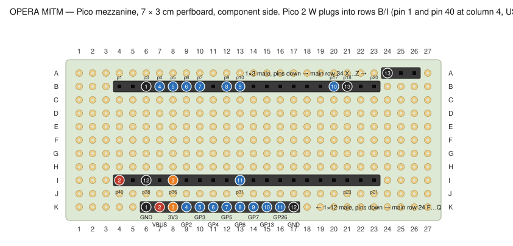

# OPERA interceptor — perfboard build (main board + Pico mezzanine)

Two boards from the kit, built **once** as the final layout:

- **Main board, 7 × 9 cm** — terminals, input stages, output drivers, relay footprints, buses, and
  two female headers the mezzanine plugs into. For the first (no-relay) test, four short wire
  links sit on the relay pads; when the G5V-2-H1 relays arrive you pull the links and solder the
  relays. Nothing else changes.
- **Pico mezzanine, 7 × 3 cm** — two 1×20 female headers for the Pico 2 W, and male pins
  underneath that plug into the main board. Plugs in over the bottom third of the main board.

Protocol: `PROTOCOL.md`. Story and measurements: `hardware/BUILD_NOTES.md` §30. Firmware pin
map: `firmware/src/config.h` (identical to the header below).

Drawings are generated by `tools-perfboard-svg.py`; the wire tables below come from the same
script, so drawing and table always agree. **Numbered tags on a drawing are the two ends of one
wire; grey bars are solder bridges between neighbouring pads.** A pad may carry one component
lead plus one wire (wires can be soldered on either side of the board).

Before soldering: count the holes. The layout assumes **26 columns (A–Z) × 34 rows** on the
7 × 9 board and **27 × 11** on the 7 × 3. If yours differ by one, keep the layout anchored to
the top-left corner (A1) — nothing uses the last column or row except the support socket at
X–Z 34, which can shift inboard.

## Pico pin map (the 1×12 header, main board row 24, F → Q)

| Header | Pico | Dir | Signal |
|---|---|---|---|
| F24 | GND | — | |
| G24 | VBUS (pin 40) | — | 5 V for relay coils and panel pull-ups |
| H24 | 3V3 (pin 36) | — | buffer pull-up |
| I24 | GP2 | in | PW_in — buffer output, **inverted** (low idle, high pressed) |
| J24 | GP3 | out | PW_out — Q2, fake Power press to the head unit |
| K24 | GP4 | out | TX_out — Q1 (UART1 TX, inverted at the pad) |
| L24 | GP5 | in | TX_in — panel OPERA TX (UART1 RX) |
| M24 | GP6 | out | RLY — Q3, energises both relays |
| N24 | GP7 | out | RST — Q4, pulls CM4 RUN_PG low |
| O24 | GP13 | in | RX_in — head-unit OPERA RX (UART0 RX) |
| P24 | GP26 | in | CONT (ADC0) |
| Q24 | GND | — | |

## Parts

| Qty | Part | Where |
|---|---|---|
| 9 positions | 5.08 mm screw terminals (7 + 2) | main row 2 |
| 2 | 1×20 female header | mezzanine rows B, I |
| 1 + 1 | 1×12 and 1×3 female header | main rows 24, 34 |
| 1 + 1 | 1×12 and 1×3 male header | mezzanine rows K, A |
| 6 | 10k | R1 R3 R5 R6 + two panel pull-ups |
| 3 | 15k | R2 R4 R8 |
| 2 | 68k | R7 + Q4 gate pull-down |
| 4 | 1k | gate resistors |
| 5 | 2N7000 | Q1 TX driver, Q2 PWR driver, Q3 relay driver, Q4 reset, Q5 PWR buffer |
| 1 | 1N5227B 3.6 V zener | Z1, band towards row 8 |
| 1 | 1N4007 | D1, band towards row 22 |
| 2 | Omron G5V-2-H1 DC5 | K1, K2 — **later** |
| ~1 m | thin insulated wire + two bare wires for the buses | |

## Main board

Placement (component leads):

| Ref | Pads | Notes |
|---|---|---|
| Terminals | B2 TXp · D2 TXh · F2 RX · H2 PWp · J2 PWh · L2 CONT · N2 GND · P2 RUN · R2 GND | car side 7 positions, Pi side 2 |
| R1 10k / R2 15k | B3–B7 / B8–B12 | TX divider |
| R3 10k / R4 15k | F3–F7 / F8–F12 | RX divider |
| R5 10k | H3–H8 | buffer gate resistor |
| Q5 2N7000 | G10 S · H10 G · I10 D | buffer |
| R6 10k | I11–I13 | buffer pull-up |
| R7 68k / R8 15k | L3–L7 / L8–L12 | CONT divider |
| Z1 | M8 band · M12 plain | |
| Q1 / Q2 | Q5 S · R5 G · S5 D / V5 S · W5 G · X5 D | TX / PWR drivers |
| R15 / R16 1k | R6–R9 / W6–W9 | gates |
| Q3 / Q4 | Q12 S · R12 G · S12 D / V12 S · W12 G · X12 D | relay / reset drivers |
| R17 1k | R13–O13 (horizontal) | Q3 gate |
| R18 1k | W13–Z13 (horizontal) | Q4 gate |
| R14 68k | W11–T11 (horizontal) | Q4 gate pull-down |
| K1 pads | B16 E16 G16 I16 / B19 E19 G19 I19 | coil · COM · NC · NO (A row / B row) |
| K2 pads | N16 Q16 S16 U16 / N19 Q19 S19 U19 | |
| R9 / R10 10k | J20–J23 / V20–V23 | panel pull-ups to VBUS |
| D1 | L20 plain · L22 band | flyback |
| GND bus | bare wire A14 → Z14, solder side | |
| VBUS bus | bare wire A23 → Z23, solder side | |
| 1×12 female | F24 → Q24 | mezzanine signals |
| 1×3 female | X34 → Z34 | mezzanine support |

Transistors: flat face towards the **top** edge (row 1) gives S · G · D left to right. Do the
diode test on each one first (S→D ≈ 0.6 V, G open to both) and trust that over the marking.
Relays: both poles are wired identically apart from what hangs off them, so either way round
works as long as the coil pair is at column B / N.

Wires and bridges:

| # | From | To | Kind | What |
|---|---|---|---|---|
| 1 | A3 | G16 | car wire | TXp → K1 NC-A |
| 2 | A4 | E19 | car wire | TXp → K1 COM-B |
| 3 | D3 | E16 | car wire | TXh → K1 COM-A |
| 4 | G3 | S16 | car wire | PWp → K2 NC-A |
| 5 | G4 | Q19 | car wire | PWp → K2 COM-B |
| 6 | J3 | Q16 | car wire | PWh → K2 COM-A |
| 7 | N3 | N14 | GND | GND terminal → GND bus |
| 8 | R3 | R14 | GND | Pi GND terminal → GND bus |
| 9 | P3 | X11 | signal | RUN terminal → Q4 drain |
| 10 | B12 | B14 | GND | TX divider bottom → GND bus |
| 11 | F12 | F14 | GND | RX divider bottom → GND bus |
| 12 | G10 | H14 | GND | Q5 source → GND bus |
| 13 | L12 | L14 | GND | CONT divider + zener → GND bus |
| 14 | Q5 | Q14 | GND | Q1 source → GND bus |
| 15 | V5 | W14 | GND | Q2 source → GND bus |
| 16 | Q12 | P14 | GND | Q3 source → GND bus |
| 17 | V12 | V14 | GND | Q4 source → GND bus |
| 18 | T11 | T14 | GND | Q4 gate pull-down → GND bus |
| 19 | S5 | I16 | signal | Q1 drain → K1 NO-A |
| 20 | X5 | U16 | signal | Q2 drain → K2 NO-A |
| 21 | S12 | O19 | signal | Q3 drain → relay coil drive |
| 22 | C19 | O19 | signal | K1 coil drive = K2 coil drive |
| 23 | C19 | L20 | signal | coil drive → D1 anode |
| 24 | C16 | C23 | VBUS | K1 coil → VBUS bus |
| 25 | O16 | O23 | VBUS | K2 coil → VBUS bus |
| 26 | F24 | E14 | GND | socket GND → GND bus |
| 27 | Q24 | O14 | GND | socket GND → GND bus |
| 28 | X34 | X14 | GND | support socket GND → GND bus |
| 29 | I13 | H24 | 3V3 | buffer pull-up → 3V3 |
| 30 | J10 | I24 | signal | buffer out → GP2 |
| 31 | W9 | J24 | signal | GP3 → Q2 gate resistor |
| 32 | R9 | K24 | signal | GP4 → Q1 gate resistor |
| 33 | C8 | L24 | signal | TX junction → GP5 |
| 34 | O13 | M24 | signal | GP6 → Q3 gate resistor |
| 35 | Z13 | N24 | signal | GP7 → Q4 gate resistor |
| 36 | G8 | O24 | signal | RX junction → GP13 |
| 37 | N8 | P24 | signal | CONT junction → GP26 |
| 38 | E16 | I16 | TEMP link | TEMP: K1 COM-A → NO-A (remove when K1 is fitted) |
| 39 | E19 | I19 | TEMP link | TEMP: K1 COM-B → NO-B (remove when K1 is fitted) |
| 40 | Q16 | U16 | TEMP link | TEMP: K2 COM-A → NO-A (remove when K2 is fitted) |
| 41 | Q19 | U19 | TEMP link | TEMP: K2 COM-B → NO-B (remove when K2 is fitted) |

Solder bridges (flow solder across the two neighbouring pads): B2–B3, B7–B8, B8–C8, F2–F3, F7–F8, F8–G8, H2–H3, H8–H9, H9–H10, I10–I11, I10–J10, L2–L3, L7–L8, L8–M8, L12–M12, M8–N8, R5–R6, W5–W6, R12–R13, W12–W13, W12–W11, B16–C16, N16–O16, B19–C19, N19–O19, L22–L23, I19–J19, J19–J20, U19–V19, V19–V20, G23–G24, B3–A3, A3–A4, D2–D3, H3–G3, G3–G4, J2–J3, N2–N3, R2–R3, P2–P3, X11–X12

## Pico mezzanine

- Two **1×20 female** headers in rows **B** and **I**, columns 4 → 23. Pico pin 1 (GP0) and
  pin 40 (VBUS) are both at **column 4** — that's the USB end, which overhangs past column 1.
- **1×12 male** header, pins pointing **down**, row **K** columns 6 → 17, in the same order as
  the main board's F → Q socket.
- **1×3 male** header, pins down, row **A** columns 24 → 26 (support; only pin 1 is connected).
- Pico pin → column: row B pin *n* is at column *n* + 3; row I pin *m* is at column 44 − *m*.

| # | From | To | Kind | What |
|---|---|---|---|---|
| 1 | 6B | 6K | GND | Pico pin 3 GND → header GND |
| 2 | 4I | 7K | VBUS | Pico pin 40 VBUS → header VBUS |
| 3 | 8I | 8K | 3V3 | Pico pin 36 3V3 → header 3V3 |
| 4 | 7B | 9K | signal | Pico pin 4 GP2 → header GP2 |
| 5 | 8B | 10K | signal | Pico pin 5 GP3 → header GP3 |
| 6 | 9B | 11K | signal | Pico pin 6 GP4 → header GP4 |
| 7 | 10B | 12K | signal | Pico pin 7 GP5 → header GP5 |
| 8 | 12B | 13K | signal | Pico pin 9 GP6 → header GP6 |
| 9 | 13B | 14K | signal | Pico pin 10 GP7 → header GP7 |
| 10 | 20B | 15K | signal | Pico pin 17 GP13 → header GP13 |
| 11 | 13I | 16K | signal | Pico pin 31 GP26 → header GP26 |
| 12 | 6I | 17K | GND | Pico pin 38 GND → header GND |
| 13 | 24A | 21B | GND | support header pin 1 → Pico pin 18 GND |

Solder bridges (flow solder across the two neighbouring pads): 

## Build order

1. Main board: both bare bus wires (rows 14 and 23) on the solder side.
2. Terminals and the two female headers (rows 24 and 34).
3. Transistors (diode-test first), then resistors, diodes, bridges.
4. Wires, in table order, ticking them off.
5. Mezzanine: female headers first, then the male headers, then its 13 wires.
6. Ohm checks below, **then** plug the mezzanine in, **then** the Pico.

## Bench checks before power (Pico and mezzanine unplugged; black probe on the GND bus)

| Between | Expect |
|---|---|
| B2 (TXp) | ~25k |
| F2 (RX) | ~25k |
| L2 (CONT) | 15k–83k, not 0 |
| H2 (PWp), D2 (TXh), J2 (PWh) | open |
| G24 (VBUS) | open |
| G24 ↔ B2, G24 ↔ H2 | ~10k each (through the temporary links) |
| B2 ↔ D2, H2 ↔ J2 | open (no relay yet, links are COM→NO, not COM→NC) |
| H24 ↔ I24 | ~10k |
| K24 ↔ D2, J24 ↔ J2 | open |
| N2, R2, F24, Q24, X34 | 0 Ω |

Powered (bench supply, negative on the GND bus):

| Apply | Read | Expect |
|---|---|---|
| 5 V → B2 | L24 | 3.0 V |
| 5 V → F2 | O24 | 3.0 V |
| 10 V → L2 | P24 | ~1.5 V |
| 3.3 V → H24, nothing on H2 | I24 | 3.3 V |
| 3.3 V → H24 and 5 V → H2 | I24 | ~0 V |
| 5 V via 10k → D2, then 3.3 V → K24 | D2 | 5 V → ~0 V |
| 5 V via 10k → J2, then 3.3 V → J24 | J2 | 5 V → ~0 V |
| 5 V → G24 | B2, H2 | ~5 V (pull-ups) |
| 3.3 V → N24, 3.3 V via 10k → P2 | P2 | ~0 V; back to 3.3 V with N24 open |

## From provisional to final (when the relays arrive)

1. Unsolder the four purple links (wires 38–41).
2. Solder K1 and K2 onto their pads, coil pins at columns B and N.
3. Check: with no power, B2 ↔ D2 = 0 Ω and H2 ↔ J2 = 0 Ω (relays released = pass-through).
4. Power the Pico: after ~1.5 s both relays click; B2 ↔ D2 goes open.
